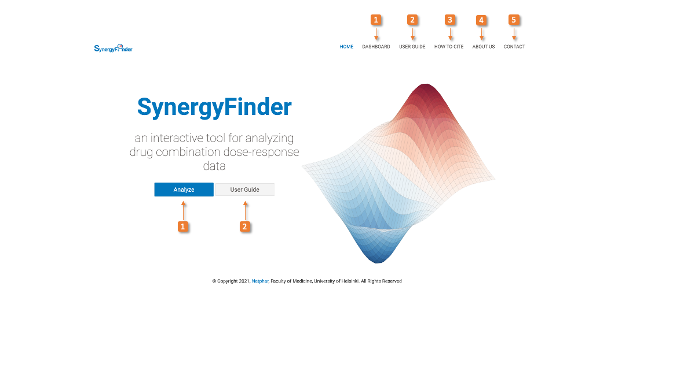

 
 
 
 
 
 
## A web application for analyzing drug combination dose-response matrix data.

**Articles**: 
Zheng S., Wang W., Aldahdooh J., Malyutina A., Shadbahr T., Pessia A., Tang J.* (2022). SynergyFinder Plus: towards a better interpretation and annotation of drug combination screening datasets. Genomics Proteomics Bioinformatics. https://doi.org/10.1016/j.gpb.2022.01.004.

Ianevski A., He L., Aittokallio T., Tang J.* (2017) SynergyFinder: a web application for analyzing drug combination dose-response matrix data. Bioinformatics 33(15):2413-2415.

He L., Kulesskiy E, Saarela J., Turunen L., Wennerberg, K., Aittokallio T., Tang J.* (2018) Methods for high-throughput drug combination screening and synergy scoring. Methods Mol Biol. 1711:351-398. doi: 10.1007/978-1-4939-7493-1_17

Yadav, B., Wennerberg, K., Aittokallio T., Tang J.* (2015) Searching for drug synergy in complex dose–response landscapes using an interaction potency model. Comput Struct Biotechnol J. 13:504-13. doi: 10.1016/j.csbj.2015.09.001 

**SynergyFinder** front-end web application source code. The public version of web application (http://synergyfinder.org or http://synergyfinderplus.org) is hosted by Shiny Server. The R-package and its source-code are freely available at http://bioconductor.org/packages/release/bioc/html/synergyfinder.html.

## User interface

For any questions please contact **Jing Tang** [@JingTang](jing.tang@helsinki.fi), or **Shuyu Zheng** [@ShuyuZheng](shuyu.zheng@helsinki.fi)

## Copyright and license

Code copyright 2021 SynergyFinder

Code released under the [BSD 3-clause license] (https://github.com/AleksandrIanevski/SynergyFinder/blob/master/LICENSE)
