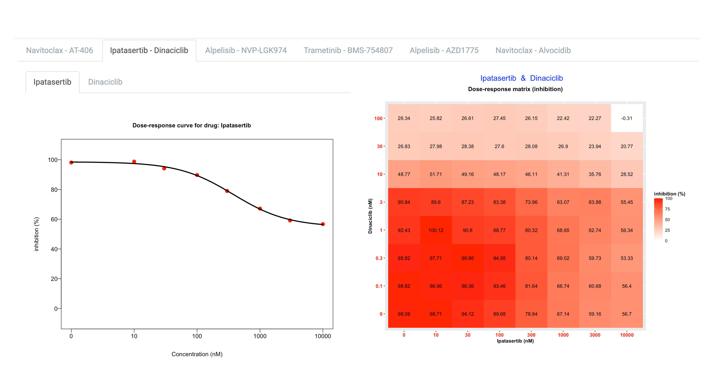
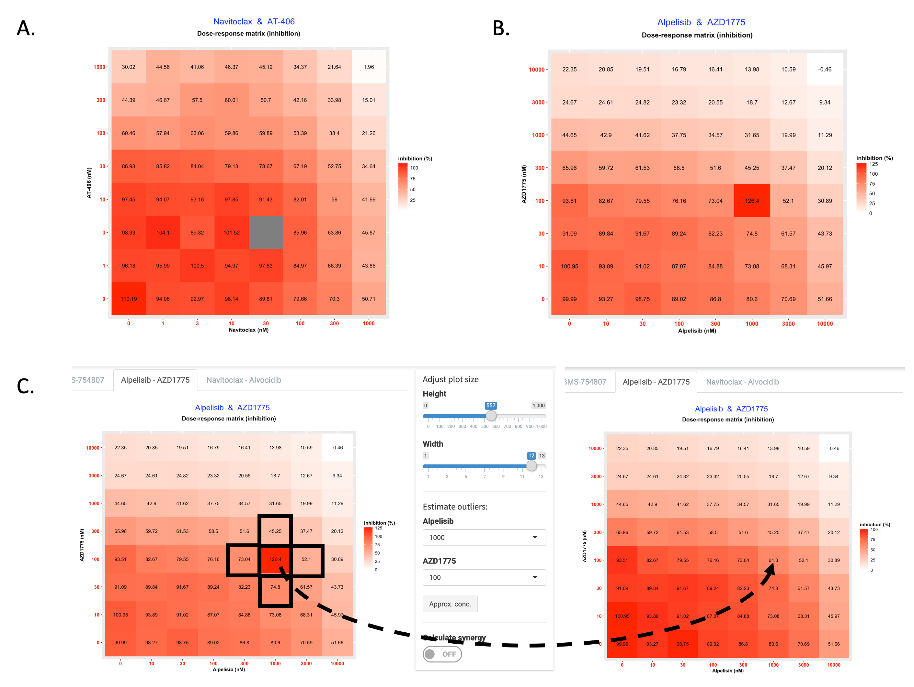

This documentation is a user manual for drug combiantion data analysis and visualization with SynergyFinder dashboard. If you have any questions after going through it, feel free to contact the group leader Dr. Jing Tang on jing.tang@helsinki.fi or reach us using the ”Feedback” button directly on the website. Note: the second option might require disabling your adblock extension in the browser.

# 1. UPLOAD DATA

## 1.1. Data Format

SynergyFinder accepts two data formats: **Table** and **Matrix**.

### 1.1.1 Table format

In the Table format, the input dose-response matrix is represented as a table where each row contains the information about the one cell in the dose-response matrix (Fig. 1).

The input table must contain the following columns:

1. PairIndex - index of drug-pair to be analyzed
2. Response - %inhibition or %viability values
3. Drug1 – name of the first drug
4. Drug2 – name of the second drug
5. Conc1 - concentration of Drug1
6. Conc2 - concentration of Drug2
7. ConcUnit - unit of concentration

The orders of rows and columns are arbitrary. The number of drug combinations (PairIndex) provided in the input
file is unlimited. The only restriction is imposed on the size of a dose-response matrix, which should comprise **at least
three rows and columns**, so that sensible synergy scores can be calculated.

### 1.1.2. Matrix format

In the Matrix format, the dose-response matrix is represented in a matrix form with drug concentrations shown along the top and left side of the matrix (Fig. 2).

The three rows should precede each dose-response matrix:

1. Drug1: name of the first drug
2. Drug2: name of the second drug
3. ConcUnit: unit of concentration

The drug concentrations should be located at the top and left side of the matrix, where left side concentrations correspond to Drug1 and concentrations shown at the top correspond to the Drug2. The number of drug combinations provided in the input file is unlimited. The only restriction is imposed on the dose-response matrix size, which should comprise at least three rows and columns, so that sensible synergy scores can be calculated.

## 1.2 Loading file

Using the "Browse" button, users could select a file from local directory for uploading. The expected file formats are:

* EXCLE file with extention ".xlsx"
* comma-delimited CSV file, with extention ".csv"
* comma-delimited TXT file, with extention ".txt"

Example data is available from [here](../www/ExampleData.zip).

## 1.3 Choose readout

After uploading the input file the user needs to specify the type of **phenotypic response** (either %inhibition or %viability). In case of %viability response type, the provided %viability values will be converted to %inhibition by the formula: %inhibition = 100 - % viability.

After specifying the type of phenotypic response the user may firstly obtain an overview of the provided data in a searchable table to check for the problematic data points.

By switching the "Visualize dose response data" toggle button, users will be directed to nex tab "Dose Response Map" for dose-response dat visualization.

# 2. Dose Response Map

This tab will show an overview of the full dose-response matrix, as well as the dose response (% inhibition) curve for the single drugs (i.e. the first column and first row in the dose-response matrix), fitted by four-parameter logistic curves. The tabs named by combination of drug names are design for navigating to maps for different combinations. (Fig. 3)

The control panel at the left side of the page enables user to change the height and width of the plot.

SynergyFinder allows for missing values in the dose-response matrix. They will be colored in gray. (Fig. 4A) They will be imputed by taking the average of the nearest responses of both drugs. For example, the missing value from the response matrix in Fig. 4A will be estimated as ( 73.04 + 74.8 + 52.1 + 45.25) / 4 = 61.3.

User could also specify the outliers (Fig. 4B) by using the ‘Estimate outliers’ widget. In this case the cell specified by users will be imputed by using the same method as that for missing value.

After adjusting the dose response matrix, user could switch the "Calculate synergy" toggle button to navigate to next tab "Synergy Map".

# 3. Synergy Map

User could set two parameters for synergy score calculation:

1. **Correct baseline**: SynergyFinder could adjust the base line of response matrix to make it closer to 0. There are 3 options available:
 
 * _non_ do notcorrect base line
 * _part_ correct base line but only adjust negative responsevalues in matrix
 * _all_ correct base line with adjusting all values in matrix.
 
2. **Method**: Select the reference model by means of which the expected synergy score will be calculated. 

The synergistic effect can be determined as the excess of observed effect over expected effect calculated with
reference models (synergy scoring models). All of the models make different assumptions regarding the expected effect. Currently, 4 reference models are available in SynergyFinder. 

* **Highest Single Agent (HSA)** [Berenbaum, 1989] states that the expected combination effect equals to the higher effect of individual drugs:
$$y_{HSA} = max(y_1, y_2)$$

* **Loewe** additivity model [Loewe, 1953] defines the expected effect $y_{LOEWE}$ as if a drug was combined with itself. Unlike the HSA and the Bliss independence models giving a point estimate using different assumptions, the Loewe additivity model considers the dose-response curves of individual drugs. The expected effect $y_{LOEWE}$ must satisfy:
$$\begin{equation} \label{eq:3}
		\frac
		{x_1}{\chi_{LOEWE}^1}
		+
		\frac{x_2}{\chi_{LOEWE}^2} 
		= 1
	\end{equation}$$
, where $x_{1,2}$ are drug doses and $\chi_{LOEWE}^1,\ \chi_{LOEWE}^2$ are the doses of drug 1 and 2 alone that produce $y_{LOEWE}$.
Using 4-parameter log-logistic (4PL) curves to describe dose-response curves the following parametric form of previous equation is derived:

$$
		\frac
		{x_1}{m_1(\fracq\chi_{LOEWE}^1}
		+
		\frac{x_2}{\chi_{LOEWE}^2} 
		= 1
$$
* **Bliss** model [Bliss, 1939] assumes a stochastic process in which two drugs elicit their effects independently, and the expected combination effect can be calculated based on the probability of independent events as:
$$\begin{equation} \label{eq:1}
		y_{BLISS}=y_1+y_2-y_1*y_2 \\
	\end{equation},\ where y_{1,2} \in [0,1]
$$

* ZIP

After these parameters have been specified the calculation of synergy scores and visualization of synergy maps is
done by switching on the "Visualize synergy score" toggle button.

The synergy score for a drug combination is averaged over all the dose combination cells. The 2D and 3D synergy maps highlight synergistic and antagonistic dose regions in red and green colors, respectively (Fig. 5).

SynergyFinder also helps to find the most synergistic area in the synergy interaction map. In a 3D synergy map users are provided with possibilities to (i) rotate, (ii) zoom, (iii) hover over to show synergy scores for any part of the synergy map and (iv) save the resulting image as HTML, PNG or SVG. In a 2D synergy map it also allows zooming in specific regions by brushing and double-clicking. After zooming the synergy score will be recalculated for the chosen area.

Fig 5. Visualization of synergy maps.

# 4. Download Report

SynergyFinder allows saving all the results in one PDF file. There are 4 types of reports are available (Fig. 6): 

* **static report** For a static report a user must specify which types of plots and which drug combinations should be included in the report (by default, all plots for all drug pair are included). In order to exclude a certain drug pair, click on it from the ‘Choose drug pairs’ box and then press DEL button.
* **dynamic report** A dynamic PDF report allows the rotation of 3D synergy maps, in order to find the best view angle for printing. 
* **short report**A short report is the concise version, where only dose-response matrices and 2D synergy maps are included. A user may also specify whether the most synergistic areas should be shown on the synergy maps.

In addition **the synergy scores** for all the drug combinations could be downloaded in a separate table for further analyses.

Fig.6. Report Generation