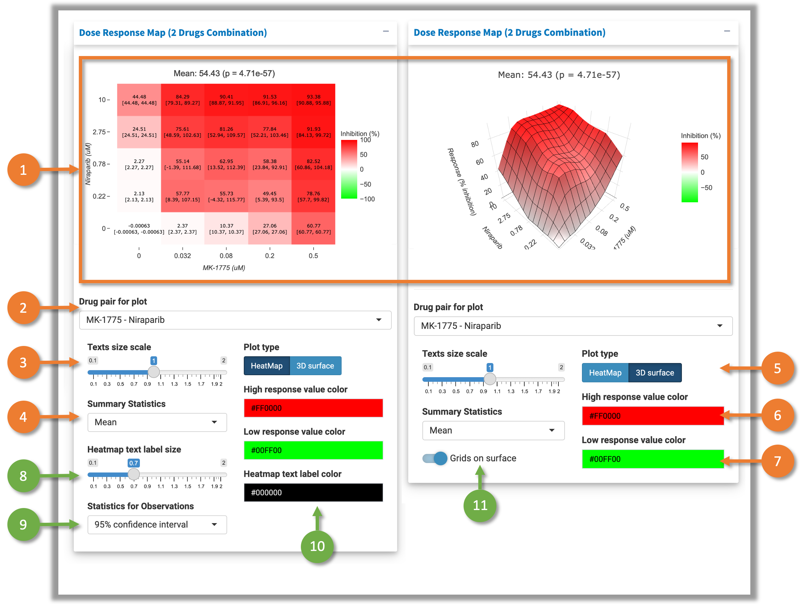

# 1 User Interface

This tab contains the dose-response curve and dose-response map for visualizing the input data. Figure 1 shows the user interface.

 Fig.1 User Interface of the "Dose Response Map" tab 

1. Select the block to visualize.
2. Select the method for baseline correction. The function adjusts the baseline of drug combination dose-response matrix closer to 0. 
There are three options available: 
"Non" - no baseline correction; 
"Part" - only the negative values in the matrix will be adjusted; 
"All" - adjusts all values in the matrix. 

Once the baseline correction method is selected, the calculation for synergy scores and sensitivity scores will be triggered. After the calculation, three new tabs ("Synergy Scores", "Sensitivity Scores", and "Download Report") will be shown. Please check corresponding pages for more details.
3. Plotting area. All of the plots can be customized and downloaded. Please check sections below for more details.

# 2 Dose Response Curve

 Fig.2 Dose-response curve 

SynergyFinder extracts the data of the single drug treatment from the input data. Each drug's dose-response is modeled using 4-parameter log-logistic curve and visualized in this panel. SynergyFinder provides various widgets to help user customize the plot:

1. Plotting area for dose response curve.
2. Select the one of the drugs in the combination to visualize.
3. Select the color for the data points.
4. Select whether the grid is shown in the background.
5. Select the color for the curve.
6. Download the plot as "SVG" file.

# 3 Dose Response Map (2 Drugs Combination)

 Fig.3 Two drugs combination dose-response map 

SynergyFinder extracts the data for all possible drug combinations from the data and visualize them in as dose response maps. Two types of plot are available: Heatmap and interactive 3D surface (Fig.3). SynergyFinder provides various widgets to help user customize the plot:

1. Interactive plotting area powered by [plotly](https://plotly.com/r/).Buttons at the top-right corner help user modify the plotting view and download the plot as "SVG" file.
2. Select the drug pair to visualize. If input data is 2-drug combination, only one option is available.
3. Adjust the text size for plot title, axis titles, axis texts, legend titles, and legend tick texts.
4. Select the summary statistic shown on the top of the top. It could be mean, median, 25% quantile or 75% quantile of the response values in the whole combination matrix. If there are replications in the input data, the p value (comparing to 0% inhibition) will be shown after the mean value.
5. Select the plot type to be Heatmap or 3D surface.
6. Select the color for the highest value in the Heatmap/surface.
7. Select the color for the lowest value in the Heatmap/surface.
8. (Only for Heatmap) Adjust the text size for the labels within Heatmap.
9. (Only for Heatmap and replicated data) Select the statistics shown below the Heatmap text labels. Available statistics are "90% confidence interval" or "standard error of mean".
10. (Only for Heatmap) Select the color for the text Heatmap on the Heatmap.
11. (Only for 3D surface) Whether to show the grids on the surface in the plot.

# 4 Dose Response Map (Multiple Drugs Combination)

 Fig.4 Two drugs combination dose-response map 

This plot is designed for visualing high-order drug combinations. The two-dimensional coordinates of each drug dose combination are determined by multi-dimensional scaling based on the similarity of their dose ranges. The response (% inhibition) will be visualized as the height of a 3D surface. Observed data points are plotted on the surface. Hovering mouse on the data points will show the concentration information of the drugs and corresponding % inhibition value.

1. Interactive plotting area powered by [plotly](https://plotly.com/r/). Buttons at the top-right corner help user modify the plotting view and download the plot as "SVG" file. Hovering mouse on the data points will show the concentration information of the drugs and corresponding % inhibition value.
2. Select whether to show the observed data points.
3. Select the color of the data points.
4. Select the color for the highest value in the surface plot.
5. Select the color for the lowest value in the surface plot.
