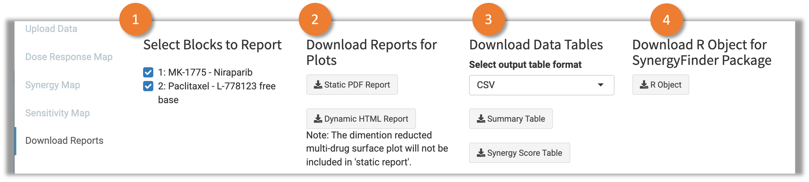

# 1 User Interface 

This tab provides the functions to download the analysis results. Figure 1 shows the user interface.

 Fig.1 User Interface of the "Download Report" tab 

1. Select the blocks to be shown in the reports.
2. Download the reports for analysis results with summary tables and plots. There are two kinds of reports available: static PDF reports and dynamic HTML reports. The setting of the plots are partially depends on the options token in the application. 
3. Download the data tables for synergy and sensitivity scores. Three file formats are available: "CSV", "TXT", "XLSX". Two tables are available for downloading: "Summary Table" - The summarized synergy score and CSS score for all the combination blocks; "Synergy Score Table" - The synergy scores, reference additive effects and the fitted effects (only for ZIP) for all the drug concentration combinations in each block.
4. Download the R list object in "RDS" file. It could be used as the input data for the [SynergyFinder R package](https://bioconductor.org/packages/release/bioc/html/synergyfinder.html).