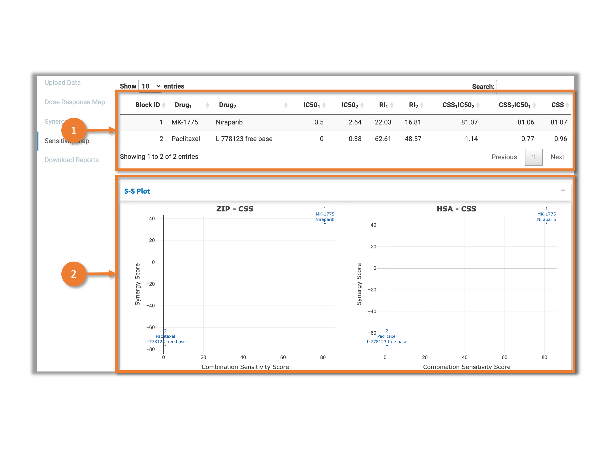

# 1 Sensitivity Score Calculation

SynergyFinder mainly calculates 3 sensitive scores: relative IC50 and relative inhibition (RI) for single drug treatment, and combination sensitivity score (CSS) for drug combinations.

## 1.1 Relative IC50

SynergyFinder extracts the single drug treatment response data from the combination matrix to fit the 4-parameter log-logistic curve:

$$y = y_{min} + \frac{y_{max} - y_{min}}{1 + 10^{\lambda(log_{10}IC_{50} - x')}}$$
where $y_{min}, y_{max}$ are minimal and maximal inhibition and $x' = log_{10}x$

## 1.2 Relative Inhibition (RI)
RI is the abbreviation of “relative inhibition”. It is the proportion of the area under the dose-response curve (fitted by four parameter log logistic model), to the maximal area that one drug can achieve at the same dose range (Fig.1). For example, RI of 40 suggests that the drug is able to achieve 40% of the maximal of inhibition (e.g. a positive control where the cell is 100% inhibited in each dose that in the range). RI is comparable between 
different scenarios, even for the same drug-cell pair but tested in different concentration ranges.

## 1.3 Combination Sensitivity Score (CSS)

CSS - drug combination sensitivity score is derived using relative IC50 values of compounds and the area under their dose-response curves. CSS of a drug combination is calculated such that each of the compounds (background drug) is used at a fixed concentration (its relative IC50) and another is at varying concentrations (foreground drug) resulting in two CSS values, which are then averaged. Each drug's dose-response is modeled using 4-parameter log-logistic curve. The area under the log-scaled dose-response curve (AUC) is then determined according to:

$$AUC = \int_{c_1}^{c_2}y_{min} + \frac{y_{max}-y_{min}}{1 + 10^{\lambda(log_{10}IC_{50}-x')}}dx'$$
where $[c_1, c_2]$ is the concentration of the foreground drug tested. [Malyutina et al., 2019]

# 2 User Interface 

This tab visualizes the sensitivity scores for the inputted drug combination screening data. Figure 2 shows the user interface.

 Fig.2 User Interface of the "Sensitivity Score" tab 

1. Summary table for sensitivity scores. Please check section 2.1 below for more details.
2. Plotting area for Synergy-Sensitivity plot(S-S plot).All of the plots can be customized and downloaded. Please check section 2.2 below for more details.

## 2.1 Sensitivity score summary table

The table contains following columns:

* block_id: The identifier for combination tests.
* drug[n]: The drug names tested in the combination.
* ic50_[n]: The relative IC50 for corresponding drug.
* ri_[n]: The relative inhibition(RI) for corresponding drug.
* css[n]_ic50[m]: The CSS for foreground drug[n] while the background drug is drug[m].
* css: The overall combination sensitivity score for whole combination matrix.

## 2.2 S-S Plots

 Fig.3 Synergy-Sensitivity Plots 

SynergyFinder plots the CSS together with different synergy scores for each combination in the input data as Synergy-Sensitivity Plot (Fig.3). It helps user to explore the combinations that not only have synergistic effect but also have high sensitivity on tested cells. SynergyFinder provides various widgets to help user customize the plot:

1.  Interactive plotting area powered by [plotly](https://plotly.com/r/). Several buttons will be shown at the top-right corner while hovering to help user modify the plotting view and download the plot as "SVG" file.
2. Select the color for the data points.
3. Adjust the size for the data points in "mm" unit.
4. Select the color for the text label.
5. Adjust the size for the text label in "pt" unit.
6. Select whether to show the text label on the plots.

# Reference

[Malyutina et.al, 2019] Malyutina, A., Majumder, M. M., Wang, W., Pessia, A., Heckman, C. A., Tang, J. Drug Combination Sensitivity Scoring Facilitates the Discovery of Synergistic and Efficacious Drug Combinations in Cancer. PLOS Computational Biology 2019, 15 (5), e1006752.