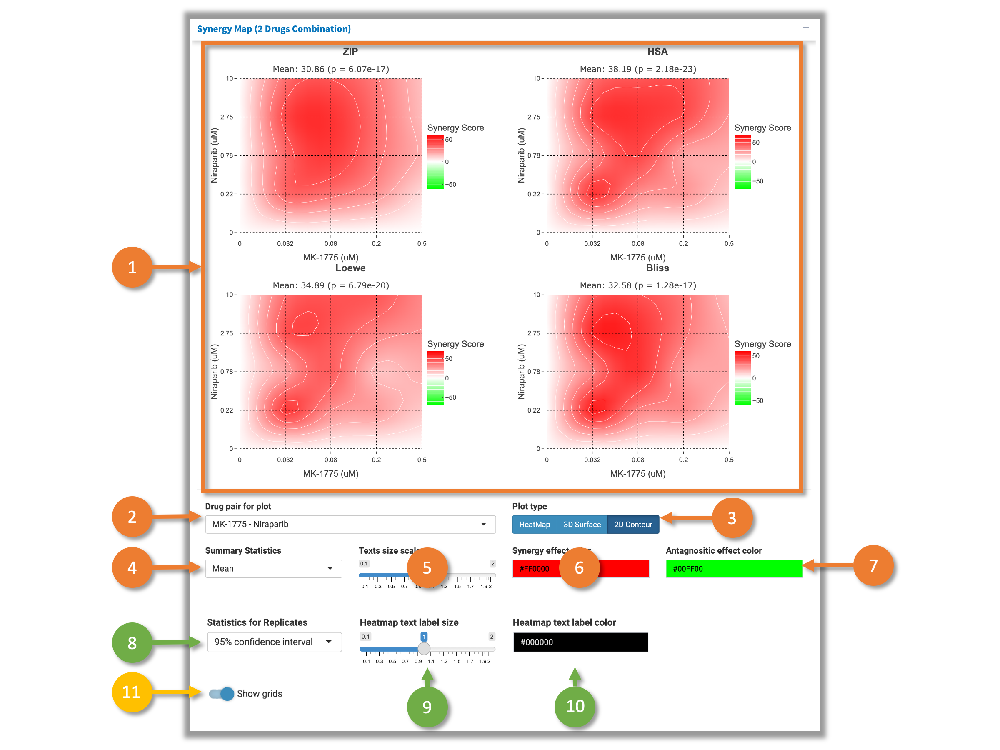
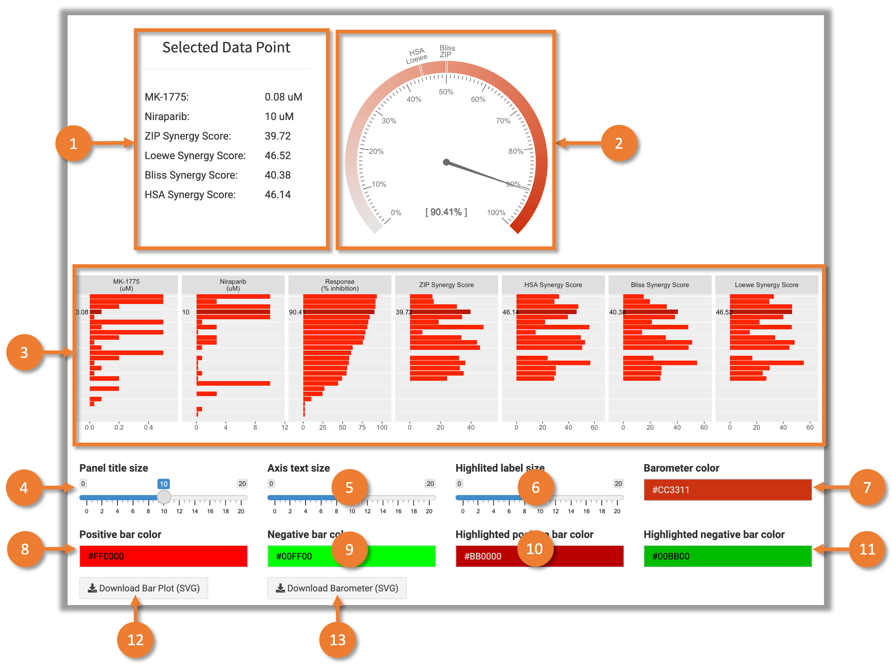

# 1 Synergy Score Calculation

The synergistic effect can be determined as the excess of observed effect over expected effect calculated with reference models (synergy scoring models). All of the models make different assumptions regarding the expected effect. Currently, 4 reference models are available in SynergyFinder. 

* **Highest Single Agent (HSA)** [Berenbaum, 1989] states that the expected combination effect equals to the higher effect of individual drugs:

$$y_{HSA} = max(y_1, y_2)$$

* **Loewe** additivity model [Loewe, 1953] defines the expected effect $y_{LOEWE}$ as if a drug was combined with itself. Unlike the HSA and the Bliss independence models giving a point estimate using different assumptions, the Loewe additivity model considers the dose-response curves of individual drugs. The expected effect $y_{LOEWE}$ must satisfy:

$$
		\frac
		{x_1}{\chi_{LOEWE}^1}
		+
		\frac{x_2}{\chi_{LOEWE}^2} 
		= 1
$$

, where $x_{1,2}$ are drug doses and $\chi_{LOEWE}^1,\ \chi_{LOEWE}^2$ are the doses of drug 1 and 2 alone that produce $y_{LOEWE}$.
Using 4-parameter log-logistic (4PL) curves to describe dose-response curves the following parametric form of previous equation is derived:

$$
		\frac
		{x_1}{m_1(\frac{y_{LOEWE}-E_{min}^1}{E_{max}^1 - y_{LOEWE}})^{\frac{1}{\lambda_1}}}
		+
		\frac{x_2}{m_2(\frac{y_{LOEWE}-E_{min}^2}{E_{max}^2 - y_{LOEWE}})^{\frac{1}{\lambda_2}}}
		= 1
$$
, where $E_{min}, E_{max}\in[0,1]$ are minimal and maximal effects of the drug, $m_{1,2}$ are the doses of drugs that produce the midpoint effect of $E_{min} + E_{max}$, also known as relative $EC_{50}$ or $IC_{50}$, and $\lambda_{1,2}(\lambda>0)$ are the shape parameters indicating the sigmoidicity or slope of dose-response curves. A numerical nonlinear solver can be then used to determine $y_{LOEWE}$ for ($x_1$, $x_2$).

* **Bliss** model [Bliss, 1939] assumes a stochastic process in which two drugs elicit their effects independently, and the expected combination effect can be calculated based on the probability of independent events as:

$$
		y_{BLISS} = y_1 + y_2 - y_1 \cdot y_2
$$

* **Zero Interaction Potency (ZIP)** [Yadav et al., 2015] calculates the expected effect of two drugs under the assumption that they do not potentiate each other:

$$
y_{ZIP} = \frac{(\frac{x_1}{m_1}) ^ {\lambda_1}}{(1 + \frac{x_1}{m_1})^{\lambda_1}}+\frac{(\frac{x_2}{m_2})^{\lambda_2}}{(1 + \frac{x_2}{m_2})^{\lambda_2}} - \frac{(\frac{x_1}{m_1})^{\lambda_1}}{(1 + \frac{x_1}{m_1})^{\lambda_1}} \cdot \frac{(\frac{x_2}{m_2})^{\lambda_2}}{(1 + \frac{x_2}{m_2})^{\lambda_2}}
$$

# 2 User Interface

This tab visualizes the synergy scores for the inputted drug combination screening data. Figure 1 shows the user interface.

 Fig.1 User Interface of the "Synergy Score" tab 

1. A selector to select the block to visualize.
2. A selector to select the method for baseline correction. This function adjusts the baseline of drug combination dose-response matrix closer to 0. There are three options: "Non" - no baseline correction; "Part" - only the negative values in the matrix will be adjusted; "All" - adjusts all values in the matrix. Once the baseline correction method is selected, the calculation for synergy scores and sensitivity scores will be triggered. After the calculation, three new tabs ("Synergy Scores", "Sensitivity Scores", and "Download Report") will be shown. Please check corresponding pages for more details.
3. Plotting area. The customizable plots will be shown in this area. All of the plots are able to be downloaded. Please check sections below for more details.

## 1.1 Synergy Map (2 Drugs Combination)

 Fig.2 Synergy Map (2 Drugs Combination) 

SynergyFinder extracts the data for all the possible drug combination pairs from the data and visualize the synergy map calculated from 4 synergy scoring models. There are 3 types of plot are available: Heatmap, contour plot and interactive 3D surface (Fig.2). SynergyFinder provides various widgets to help user customize the plots:

1. Interactive plotting area powered by [plotly](https://plotly.com/r/). Several buttons will be shown at the top-right corner while hovering to help user modify the plotting view and download the plot as "SVG" file.
2. Select the drug pair to visualize. If input data is 2-drug combination, only one option is available.
3. Select the plot type to be Heatmap, contour plot or 3D surface.
4. Select the summary statistic shown on the top of the top. It could be mean, median, 25% quantile or 75% quantile of the response values in the whole combination matrix. If there are replications in the input data, the p value (comparing to 0% inhibition) will be shown after the mean value.
5. Adjust the text size for plot title, axis titles, axis texts, legend titles, and legend tick texts.
6. Select the color for the highest value in the plot.
7. Select the color for the lowest value in the plot.
8. (Only for Heatmap and replicated data) Select the statistics shown below the Heatmap text labels. Available statistics are "90% confidence interval" or "standard error of mean".
9. (Only for Heatmap) Adjust the text size for the labels within Heatmap.
10. (Only for Heatmap) Select the color for the text Heatmap on the Heatmap.
11. (Only for 3D surface) Whether to show the grids on the surface in the plot.

# 3 Bar and Barometer Plots

 Fig.3 Bar and Barometer Plots 

SynergyFinder visualize the whole matrix's dose response and synergy scores in a group of bar plot. The barometer plot is provided for user to compare the synergy scores from different synergy scoring models (Fig.3). SynergyFinder provides various widgets to help user customize the plot:

1. A table for the information at the selected data point (one drug dose combination in the matrix) in the Bar plot.
2. Barometer plot for the selected data point in Bar plot. Then needle points to the observed response value. The 4 ticks on the color bar mark the reference additive effect response value calculated by different models.
3. An interactive bar plot to show the over all information of the whole combination matrix. Clicking on a specific row of bars will highlight it and show it's information in the table and barometer above. Double click on certain panel will sort the bars according to the values of that panel.
4. Adjust the text size for the panel title.
5. Adjust the text size for the axis texts.
6. Adjust the text size of the text label on highlighted bars.
7. Select the color for the 100% inhibition in the barometer.
8. Select the color for the bars of positive value.
9. Select the color for the bars of negative value.
10. Select the color for the highlighted bars of positive value.
11. Select the color for the highlighted bars of negative value.
12. Download Bar plot as "SVG" file.
11. Download Bar plot as "SVG" file.

# Reference

[Berenbaum, 1989] Berenbaum, M. C. (1989). What is synergy? Pharmacol. Rev., 41(2):93–141.

[Bliss, 1939] Bliss, C. I. (1939). The toxicity of poisons applied jointly1. Annals of Applied Biology, 26(3):585–615.

[Loewe, 1953] Loewe, S. (1953). The problem of synergism and antagonism of combined drugs. Arzneimit- telforschung, 3(6):285–290.

[Yadav et al., 2015] Yadav, B., Wennerberg, K., Aittokallio, T., and Tang, J. (2015). Searching for Drug Synergy in Complex Dose-Response Landscapes Using an Interaction Potency Model. Comput Struct Biotechnol J, 13:504– 513.