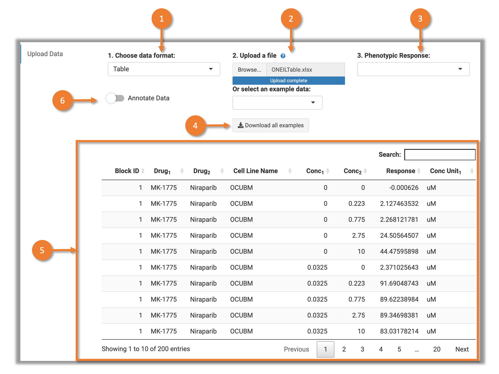

# 1 Prepare Input Data

## 1.1 Data Format

SynergyFinder accepts two formats of input: **Table** and **Matrix**.

### 1.1.1 Table Format

In the Table format, the dose-response data is represented as a long table where each row represent one observation in the dose-response matrix (Fig.1).

Fig.1 Input file in Table format.

The input table must contain the following columns (The column naming style used in the old SynergyFinder or [DrugComb](https://drugcomb.org/), i.e. 'Alternative Column names' are accepted):

| Required Columns | Alternative Column names         | Description                                                     |
| ---------------- | -------------------------------- | --------------------------------------------------------------- |
| block\_id        | PairIndex, BlockId               | Identifier for the drug combination blocks.                     |
| drug1            | Drug1, drug\_row, DrugRow        | Name of the first tested drug.                                  |
| drug2            | Drug2, drug\_col, DrugCol        | Name of the second tested drug.                                 |
| conc1            | Conc1, conc\_row, ConcRow        | Concentration of first tested drug.                             |
| conc2            | Conc2, conc\_col, ConcCol        | Concentration of second tested drug.                            |
| response         | Response, inhibition, Inhibition | Cell response to the drug treatment (%inhibition or %viability).|
| conc\_unit       | ConcUnit                         | Unit of concentration for drugs. This column could be replaced by multiple separated columns for each tested drugs (see table below), while different unit was used for measuring the concentrations.|

| Optional Columns | Alternative Column names         | Description                                                                              |
| ---------------- | -------------------------------- | ---------------------------------------------------------------------------------------- |
| conc\_unit1      | conc\_r\_unit                    | Unit of concentration for the first drug. It is used if the concentration units are different for the tested drugs.|
| conc\_unit2      | conc\_c\_unit                    | Unit of concentration for the second drug. It is used if the concentration units are different for the tested drugs.|
| conc\_unit[n]    |                                  | Unit of concentration for n_th drug. For example, "conc\_unit3" for the n_th tested drug. It is used if the concentration units are different for the tested drugs and more than 2 drugs were combined.|
| drug[n]          |                                  | Name of the n_th_ tested drug. For example, "drug3" for the third tested drug. It is required if more than 2 drugs were combined.|
| conc[n]          |                                  | Concentration of n_th_ tested drug. For example, "conc3" for the third tested drug. It is required if more than 2 drugs were combined.|
| cell\_line\_name |                                  | Name of the cell line. The cell line names will be used for "data annotation". |

**Note:** 

1. The duplicated concentration combinations in one block (with the same "block_id") will be treated as replicates.
2. There is no restriction on the number of drug combinations for the input file. The data should however, contain **at least three concentrations for each drug**, so that sensible synergy scores can be calculated.
3. SynergyFinder allows for missing values in the dose-response matrix. The missing value will be automatically imputed by [mice](https://amices.org/mice/) R package.

### 1.1.2 Matrix Format

In the Matrix format, the dose-response matrix is represented in a matrix with drug concentrations shown along the top and left edge of the matrix (Fig.2). The three rows below should precede each dose-response matrix:

1. **Drug1** name of the first drug
2. **Drug2** name of the second drug
3. **ConcUnit** unit of concentration

Fig.2 An input file in Matrix format. Two dose-response matrices are provided as an example.

**Note:** 

1. Matrix format only works on 2 drug combination data. Please use _table_ format for combinations with more than 3 drugs.
2. The drug concentrations should be located at the top and left side of the matrix, where concentrations located at the left side correspond to Drug1 and concentrations located at the top correspond to the Drug2.
3. There is no restriction on the number of drug combinations for the input file. The data should however, contain **at least three concentrations for each drug**, so that sensible synergy scores can be calculated.
4. SynergyFinder allows for missing values in the dose-response matrix. The missing value will be automatically imputed by [mice](https://amices.org/mice/) R package.

## 1.2 File Format

SynergyFinder accepts following file formats:

* EXCLE file with extension ".xlsx"
* comma-delimited CSV file, with extension ".csv"
* tab-delimited TXT file, with extension ".txt"

## 1.3 Example Data

Example data is available from <a href="ExampleData.zip" download>here</a>.

# 2 Upload File

The "Update Data" tab is designed for user to upload file. Figure 3 shows the user interface.

Fig.3 User Interface of the "Update Data" tab 

1. Choose the data format used in the uploaded file. Please check section "1.1 Data Format" for more details.
2. Select the file to upload from your local directory. Please check section "1 Prepare Input Data" for more details.
3. Choose the phenotypic response which is used to measure the cell's response to drug combinations. Available options in SynergyFinder are: _inhibition_ (% inhibition to cell growth or other signals. Normalized by negative control.) and _viabillity_ (% cell viability after treatment. Normalized by negative control. In case of %viability response type, the provided %viability values will be converted to %inhibition by the formula: $\%inhibition = 100 - \%viability$.) Once a response type is selected, a new tab "Dose Response Map" will be shown in the left sidebar. User could click it to visualize dose-response map (see the [next page]() of the user guide).
4. A button to download the example data. It includes the 2 drug combination screening data, 3 drug combination screening data.
5. The overview for the input data in table format. It will be shown while the file is successfully uploaded and formatted.
6. A switch for data annotation. It will be shown once the data is successfully uploaded.By turning it on, the program will query the external databases for the drug and cell line (If "cell_line_name" column was found in the input data) information. Three or two tables for drug information, drug MOA information and cell line information (Fig.4) will be shown below the input data table.

Fig.4 Annotation for drug and cell line

While the file is successfully uploaded, an overview of the input data will be shown for checking the problematic data points.